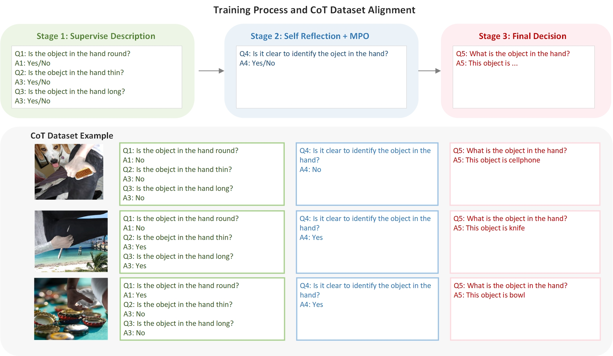

# OCC-MLLM-COT
Multi-stage OCClusion reasoning with MLLM via 3D-aware supervision and Chain-of-Thoughts Reasoning
<p align="center">
  
  <br>
  <em>Multi-stage OCClusion reasoning with MLLM via 3D-aware supervision and Chain-of-Thoughts Reasoning</em>
  <br>
  <a href="https://github.com/chaoyiwang09/OCC-MLLM/tree/main" target="_blank">GitHub</a> | 
  <a href="https://arxiv.org/abs/2504.04781" target="_blank">Paper</a> |
  <a href="https://pan.baidu.com/s/1bZ4NztX8WlFkHoTsjHHSVg?pwd=cprj" target="_blank">Model Link</a>
</p>

## 📖 Introduction

OCC-MLLM-COT is a cutting-edge framework that addresses the challenge of occlusion reasoning in multi-modal large language models (MLLM). By integrating 3D-aware supervision with chain-of-thought reasoning, our approach significantly improves model understanding of partially occluded objects in images.

The framework is built upon two foundational environments:
- [InternVL](https://github.com/OpenGVLab/InternVL): A powerful multi-modal foundation model
- [MOHO](https://github.com/ZhangCYG/MOHO): A state-of-the-art 3D object reconstruction system

Key features include:
- Multi-stage occlusion reasoning pipeline
- 3D-aware visual supervision
- Chain-of-thought (CoT) dataset alignment
- Mixed Preference Optimization (MPO) for self-reflection
- Support for models from 1B to 8B parameters

## 🎬 Example Results
The following figure illustrates the overall training pipeline and the Chain-of-Thought (CoT) dataset alignment strategy. It highlights the supervised description phase, the self-reflection stage with Mixed Preference Optimization (MPO), and the final decision process.

<p align="center">
  
</p>

## 📰 Latest News

- **[April 2025]** OCC-MLLM-V1: Towards Step-by-Step Occlusion Reasoning via Multi-modal Large Language Models With Internal Chain-of-Thoughts(CoTs) Guidance - Submitted
- **[March 2025]** OCC-MLLM-CoT-Alpha: Towards Multi-stage Occlusion Recognition Based on Large Language Models via 3D-Aware Supervision and Chain-of-Thoughts Guidance - Accepted
- **[March 2025]** OCC-MLLM-CoT: Self-Correction Enhanced Occlusion Recognition with Large Language Models via 3D-aware Supervision, Chain-of-Thoughts Guidance - Released and Submitted

## 🌟 Community Works

Projects and extensions built with OCC-MLLM-COT:

- [OCC-MLLM-COT](https://github.com/chaoyiwang09/OCC-MLLM/tree/main/occ-mllm-cot)
- [OCC-MLLM-V1](https://github.com/chaoyiwang09/OCC-MLLM/tree/main/occ-mllm-v1)

## 📝 Todo List

- [ ]  Build a 3,000,000-image embodied intelligence training dataset
- [ ] Improve occlusion grading algorithm

## 🚀 Quickstart

### Repository Structure

```
OCC-MLLM-COT/
├── SFT2/                       # Sample checkpoint folder
│   ├── generate_train_json_Q1Q6.py     # Script to generate training data
│   ├── eccv_train_convert_sft2.jsonl   # Training dataset
│   ├── finetune-sft2.sh               # Fine-tuning script
│   ├── inferenceImageAcc.py           # Inference scripts
│   ├── internvl_chat_finetune.py      # Core training script
│   └── result/                        # Inference results
├── requirements.txt            # Dependencies
└── README.md                   # This file
```

### Installation

```bash
# Clone the repository
git clone https://github.com/username/OCC-MLLM-COT.git
cd OCC-MLLM-COT

# Set up the InternVL environment
conda create -n internvl python=3.9
conda activate internvl
pip install -r requirements.txt
pip install flash-attn==2.3.6 --no-build-isolation  # Optional, for training

# Set up the MOHO environment (needed for 3D reconstruction)
git clone https://github.com/ZhangCYG/MOHO.git
cd MOHO
conda create -n moho python=3.9
conda activate moho
pip install -r requirements.txt
```

### Download Pretrained Models

Our pretrained models are available on Baidu Netdisk:
- Link: [https://pan.baidu.com/s/1bZ4NztX8WlFkHoTsjHHSVg?pwd=cprj](https://pan.baidu.com/s/1bZ4NztX8WlFkHoTsjHHSVg?pwd=cprj)
- Extraction code: `cprj`

| Model Name | Parameters | File Name |
|:----------:|:----------:|:---------:|
|Qwen2-1B | ~1 Billion | outputdir-1b-Q1-Q6-MPO-SC-067.tar.gz |
|Internlm2-2B | ~2 Billion | outputdir-2b-Q1-Q6-MPO-SC-067.tar.gz |
|Phi3-4B | ~4 Billion | outputdir-4b-Q1-Q6-MPO-SC-069.tar.gz |
|Internlm2.5-8B | ~8 Billion | outputdir-8b-Q1-Q6-MPO-SC-075.tar.gz |

### Basic Usage

```bash
python inference.py
```

## 📊 Evaluation

### Benchmarks

Performance comparison on decision scores across different models and training settings:

| Model | 10K-Learning Decision | 100K-Learning Decision |
|:-----:|:---------------------:|:----------------------:|
| GPT4v (Zero-shot) | 0.0361 | - |
| GPT4o (Zero-shot) | 0.1306 | - |
| GPT4o (Learning) | 0.5532 | - |
| MiniGPT4-V2-8B | - | 0.3209 |
| Mini-Gemini-8B | - | 0.4981 |
| **OCC-MLLM-CoT (1B)** | 0.6625 | 0.6724 |
| **OCC-MLLM-CoT (2B)** | 0.6643 | 0.6762 |
| **OCC-MLLM-CoT (4B)** | 0.6654 | 0.6921 |
| **OCC-MLLM-CoT (8B)** | **0.6768** | **0.7526** |

*Note: For fine-tuning GPT-4o, we prepared 110,000 images, but 90,860 were automatically skipped due to the training policies, leaving 10,140 images for fine-tuning.*

## 🧠 Training and Testing

### Data Preparation

Generate training data with our preprocessing script:
```bash
python generate_train_json_Q1Q6.py
```

### 3D Image Reconstruction

For 3D reconstructed images:
```bash
python recontruct_3Dimage.py
```

Generated images will be available at:
```
https://obmandataset.s3.us-east-2.amazonaws.com/3d_views_fine_test_all/{imageID}_0_obman_test_rgb_{imageID}.jpg.png
```

### Fine-tuning

Based on the file structure you've shown me, I'll provide a comprehensive guide for the fine-tuning process. Let me update the fine-tuning section with clear, step-by-step instructions:

## Fine-tuning Process

### Data Preparation
1. Navigate to the project's source directory:
   ```bash
   cd OCC-MLLM/occ-mllm-cot/src
   ```

2. Prepare SFT1 training data:
   ```bash
   cd SFT1
   python internvl_chat_finetune.py
   # This will generate eccv_train_convert_sft1.jsonl
   ```

3. Prepare SFT2 training data:
   ```bash
   cd ../SFT2
   python generate_train_json_Q1Q6.py
   # This will generate eccv_train_convert_sft2.jsonl and eccv_train_convert3.jsonl
   ```

4. Prepare MPO training data:
   ```bash
   cd ../MPO
   python generate_train_json_balanced.py
   python generate_train_json_balanced-dpo.py
   # This will generate eccv_train_balanced_dpo_train.jsonl and eccv_train_convert6_balanced_dpo_train.jsonl
   ```

### Training Process

1. Activate the InternVL environment:
   ```bash
   conda activate internvl
   ```

2. Run SFT1 training:
   ```bash
   cd SFT1
   # Ensure internvl_chat_finetune.py is in this directory
   bash finetune-sft1.sh
   # This will create models in .ipynb_checkpoints folder
   ```

3. Run SFT2 training:
   ```bash
   cd ../SFT2
   # Ensure internvl_chat_finetune.py is in this directory
   bash finetune-sft2.sh
   # This will create models in .ipynb_checkpoints folder
   ```

4. Run MPO training:
   ```bash
   cd ../MPO
   # Ensure internvl_chat_dpo.py is in this directory
   bash finetune-mpo.sh
   # This will create final models in .ipynb_checkpoints folder
   ```

### Evaluation

After completing all training stages, you can run the inference script to evaluate your model:

```bash
cd SFT2  # or any other directory containing inferenceImageAcc.py
conda activate internvl
python inferenceImageAcc.py
```

### Important Notes

- Make sure each directory contains the correct version of the required Python files before running scripts
- The training process is sequential: SFT1 → SFT2 → MPO
- Each stage builds upon the previous stage's checkpoint
- Monitor the `.ipynb_checkpoints` folder in each directory for saved model checkpoints
- The final model after MPO training represents the complete OCC-MLLM-CoT model

This comprehensive training pipeline implements the 3D-aware supervision and Chain-of-Thought reasoning approach described in your paper.

### Inference

Run inference with the trained model:
```bash
# Activate the InternVL environment
conda activate internvl

# Run inference
python inference.py
```

## 📝 Citation

If you find our work useful in your research, please consider citing:

```bibtex
@misc{wang2025occmllmcotalphamultistageocclusionrecognition,
  title={OCC-MLLM-CoT-Alpha: Towards Multi-stage Occlusion Recognition Based on Large Language Models via 3D-Aware Supervision and Chain-of-Thoughts Guidance},
  author={Chaoyi Wang and Baoqing Li and Xinhan Di},
  year={2025},
  eprint={2504.04781},
  archivePrefix={arXiv},
  primaryClass={cs.CV},
  url={https://arxiv.org/abs/2504.04781},
}
```

## 📄 License Agreement

This project is licensed under the [MIT License](LICENSE).

```
MIT License

Copyright (c) 2025 Chaoyi Wang, Baoqing Li, Xinhan Di

Permission is hereby granted, free of charge, to any person obtaining a copy
of this software and associated documentation files (the "Software"), to deal
in the Software without restriction, including without limitation the rights
to use, copy, modify, merge, publish, distribute, sublicense, and/or sell
copies of the Software, and to permit persons to whom the Software is
furnished to do so, subject to the following conditions:

The above copyright notice and this permission notice shall be included in all
copies or substantial portions of the Software.

THE SOFTWARE IS PROVIDED "AS IS", WITHOUT WARRANTY OF ANY KIND, EXPRESS OR
IMPLIED, INCLUDING BUT NOT LIMITED TO THE WARRANTIES OF MERCHANTABILITY,
FITNESS FOR A PARTICULAR PURPOSE AND NONINFRINGEMENT. IN NO EVENT SHALL THE
AUTHORS OR COPYRIGHT HOLDERS BE LIABLE FOR ANY CLAIM, DAMAGES OR OTHER
LIABILITY, WHETHER IN AN ACTION OF CONTRACT, TORT OR OTHERWISE, ARISING FROM,
OUT OF OR IN CONNECTION WITH THE SOFTWARE OR THE USE OR OTHER DEALINGS IN THE
SOFTWARE.
```

## 🙏 Acknowledgements

We extend our gratitude to:
- [InternVL Team](https://github.com/OpenGVLab/InternVL) for their foundational multi-modal large language model framework.
- [MOHO Team](https://github.com/ZhangCYG/MOHO) for their state-of-the-art 3D object reconstruction system.
- Our research institution for providing computational resources, Shanghai Institure of Microsystem and Information Technology, Chinese Academy of Sciences and Giant Network.

## 📬 Contact Us

For questions, issues, or collaboration opportunities:

- **Main Contact**: Chaoyi Wang - chaoyiwang@mail.sim.ac.cn
Xinhan Di - deepearthgo@gmail.com
